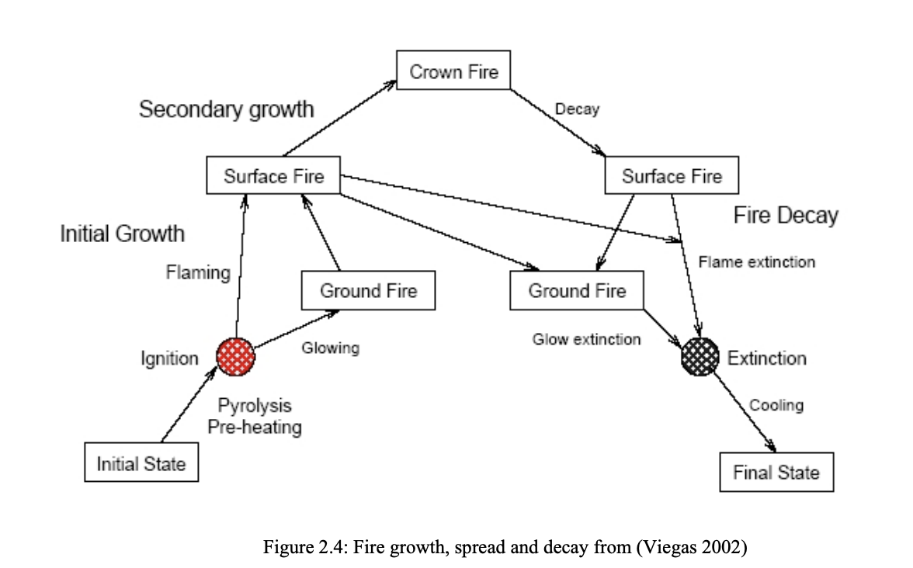
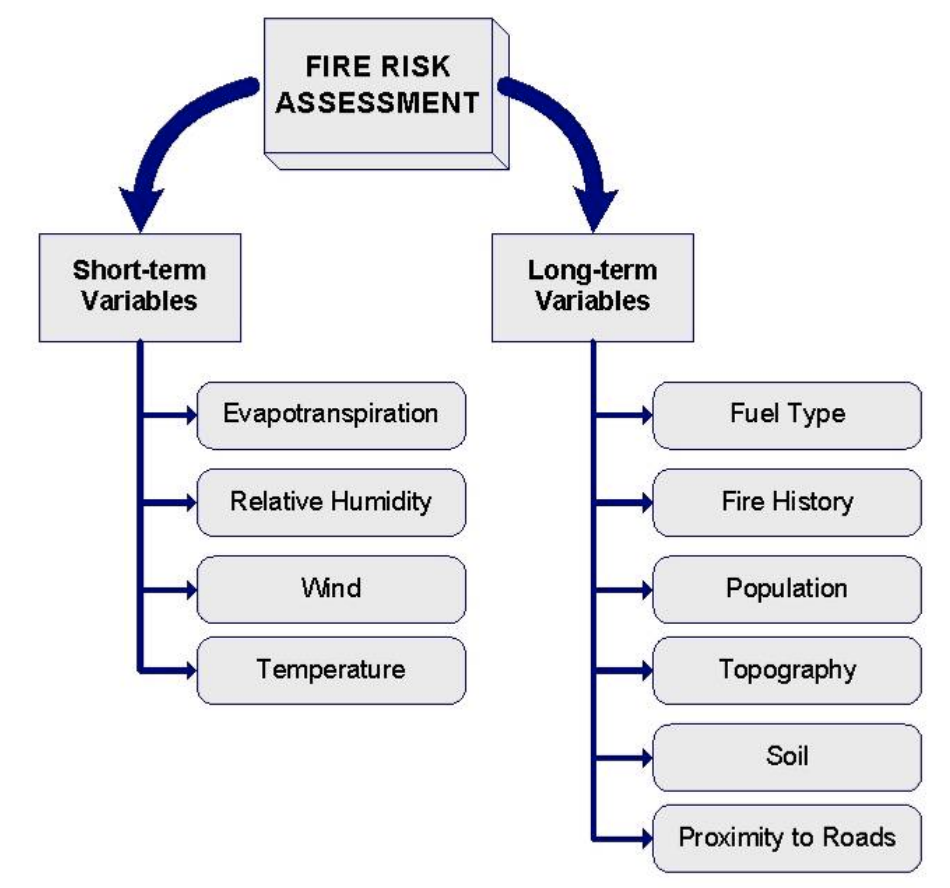

# ASSESSMENT OF FOREST FIRE RISK IN EUROPEAN MEDITERRANEAN REGION: Comparison of satellite-derived and meteorological indices [1]

## Usual estimation / abstract

The estimation of forest fire risk involves the integration of meteorological and other fuel-related variables leading to an index that assesses the different levels of risk. Two indices that are frequently used to estimate the level of fire risk are the Fire Weather Index (FWI) and the Normalized Difference Vegetation Index (NDVI).

Although the correlation between the number of fires and the level of risk determined by the indices has been demonstrated; however the analysis that lead to this conclusion considered only the areas where the fires took place.

## Why we need to prevent fire risk / Introduction or something else???

Understanding how to react in case of an event has to be analysed together with how to maintain the level of damages lower than possible; which means focussing the attention on prevention. Prevention that has not enough been considered since it is possible to judge useless an investment of money in trying to prevent a disaster which, effectively, could not occur. If money was invested for prevention of a natural disaster which do not occurred, these money would be reasonable considered as wasted. Thus, why invest money if is not strictly necessary? First of all because it is possible to demonstrate that the economical request subsequently a natural disaster abundantly overpass the request necessary for prevention. Moreover, because prevention itself does not imply injured people or died. Thus, the benefits produced by a good prevention scheme are undisputable even though, normally,
they are identifiable in the long period.

## Fire as disaster describtion

Forest fire is a major natural disaster for the European territory. Also known as wildfires, vegetation fires or grass fires, it represents an uncontrolled fire in wildland. It is often caused by human careless or arson and, thus, it is one of the natural disasters more disposable to be prevented by a good preventive scheme. 

```
Provide information how many forests we have in north european territory.
```

## Approach

Traditionally, an index of risk has been considered suitable if it presents some particulars behaviours. On one hand, the observed values must be show higher risk during the period of higher presence of fires. On the other hand, the observed fires have to occur in areas having higher values of risk. These requirements have been adopted in order to assess the performance of an index of risk. Nevertheless, limitations are observables. Both the analyses do not differentiate values of risk over burnt areas from values over non burned areas. Moreover, they do not allow direct comparison between results obtained by different indices. In this study, those limitations have been solved by the introduction of a qualitative and a statistical approach of analysis. In both the approaches the distribution of the values of the indices over burnt areas is compared to the distribution of indices values all over the territory. If the proposed indices are successful, then a statistical difference between the distributions should be observed; a more evident difference point out a better potential of a particular index of forest fire risk.

## Fire indices (The indices of risk)

Two different families of indices of forest fire risk have been investigated. Four indices of risk were derived by remote sensing data and one was derived by meteorological information. Due to their low spatial resolution, these indices permit a wide coverage at high temporal resolution and, consequently, have been retained suitable to be applied for the creation of daily maps of forest fire risk at extended scale. Their different nature permits to assess the rule that the vegetation status or the meteorological conditions plays in the assessment of forest fire risk. The different nature of the considered indices, however, leads to a non direct possibility of comparison of the indices. Superficial analyses of the results could easily conduct to good potential for an index. The analysis of the trend of observed values and the analysis of the distribution of fire in the territory, for example, furnish information which could be use to classify the potential of an index. Nevertheless, they are not able to deeply investigate the real potential of an index. Besides, the process of reclassification of index values into classes of risk could highlights a not real high level of correlation between number of fires and classes of risk. To better focus these problems, following are reported as example the results obtainable using these analyses.

### Average trend

### Index re-classification

## Qualitative analysis

The qualitative analysis adopted in this work permits to combine the two previous analyses. It compares the values of an index over burnt areas with the normal distribution of the values of that index. Thus, it analyses the values over burnt areas considering also values all over the territory. This analysis permits to verify the basis hypothesis that a fire tend to occur where a high level of risk is present. However, also this analysis does not permit an evaluation of the results more than the one furnished by a visual approach.

## Statistical analysis

It has been deeply discussed regarding the importance to adopt a method of analysis of the indices able to assess the results numerically and independently by the adopted index the performance of this index. In the context of this work, the statistical approach estimates how much the information derived by the use of a particular index of risk could be better than the use of a random value. The introduction of the use of a random value in order to estimate the performance of an index permits the detachment of the obtained result from the index characteristics, as the range of values or the scale of reclassification and, thus, it permits a comparison of results obtained by different indices. This methodology evaluates day by day the value added in the estimate of fire risk given by a particular index. 

Concluding, for the first time it has been possible to quantify the results obtainable by the use of different indices of risk in the forest fire assessment. 

## Forest

Forest: an ecosystem characterised by a more or less dense and extensive tree cover, often consisting of stands varying in characteristics such as species composition, structure, age class, and associated processes, and commonly including meadows, streams, fish, and wildlife – note forests include special kinds such as industrial forests, non industrial private forests, plantations, public forests, protection forests, and urban forests, as well as parks and wilderness (Helms 1998). 

Forest: land with tree crown cover (or equivalent stocking level) of more than 10 % and area of more than 0.5 ha. The trees should be able to reach a minimum height of 5 m at maturity in situ. It may consist either of closed forest formations where trees of various storeys and undergrowth cover a high proportion of the ground, or of open forest formations with a continuous vegetation cover in which tree crown cover exceeds 10 %. Young natural stands and all plantations estab-lished for forestry purposes which have yet to reach a crown density of 10 % or tree height of 5m are included under forest, as are areas normally forming part of the forest area which are temporarily unstocked as a result of human intervention or natural causes but which are expected to revert to forest. The definition of ‘forest’ includes: forest nurseries and seed orchards that constitute an integral part of the forest; forest roads, cleared tracts, firebreaks and other small open areas within the forest; forest in national parks, nature reserves and other protected areas such as those of special environmental, scientific, historical, cultural or spiritual interest; windbreaks and shelterbelts of trees with an area of more than 0.5 ha and a width of more than 20 m. Rubberwood plantations and cork oak stands are included. However, the definition of ‘forest’ excludes: land predominantly used for agricultural practices (European Commission 2003).

The first thought tends to relate forest to trees and to consider them as synonyms. Nevertheless, trees can not survive without the complex structure situated in their surrounding.

### Forest in Europe 

## Fire
Fire: rapid burning of combustible material with the evolution of heat and usually accompanied by flame (Encyclopædia Britannica 2005).

Together with air, earth and water was considered as one out of four elements that, in ancient and medieval cosmology, constituted the physical universe. Initially originated by lightning, it quickly became an essential tool for the human race. Indispensably to keep warm and cook the food, it was adopted also in hunting animals and to clear forests of underbrush. Fire is an ecological factor of ex-traordinary power. It is able to transform the environment and to influence the structure, the composition and the richness of the vegetation. It could assume uneven vigour and frequency.

## Forest fire

Forest fire: a fire burning uncontrolled on lands covered wholly or in part by timber, brush, grass, grain, or other inflammable vegetation (FAO 1986).
Wildfire, wildland fire: any fire occurring on wildland expect a fire under prescription (FAO 1986).

Forest fire: fire which breaks out and spreads on forest and other wooded land or which breaks out on other land and spreads to forest and other wooded land. The definition of ‘forest fire’ excludes: prescribed or controlled burning, usually with the aim of reducing or eliminating the quantity of accumulated fuel on the ground (European Commission 2003). 

## Fuel

Fuel: the combustible organic material in forests and other vegetation types as grass, branches and wood, including agricultural systems which can be consumed by fire. A fuel type is any identifiable association of fuel elements of distinctive species, form, size, arrangement or other characteristics that will cause a predictable rate of fire spread or difficulty of control under specified weather conditions (FAO 1986).

## Fire type

A forest fire could occur and evolve assuming different characteristics. Consequently, different types
of forest fire have been classified (figure 2.4). The most familiar fire type is the surface fire. It represents the most common propagation regime and consists in rapidly burning fire that sweep quickly over an area, consuming litter and the aboveground portions of herbs, shrubs, grasses and lower branches of trees. If conditions are favourable a surface fire may extend to the upper layers of the crown foliage. A fire affecting mainly the crowns of the woody vegetation is called crown fire. Frequently, it leaves most of the steam and the forest floor relatively untouched and is difficult to control since strictly dependent to wind conditions. Moreover, a fire could evolve below the terrain. Referred to as ground fire, it consists principally in largely flameless fire that burn slowly through thick surface accumulation of organic matter, duff and roots and it is very difficult to detect and control. In some particular conditions a ground fire can became a flaming surface fire if not adequately treated (Viegas 2002). Furthermore, more the one form of fire could take place at the same time (i.e. a crown fire could be accompanied by a ground fire).



## Effect

The evaluation of the effects of a fire a priori is not always possible because the consequences of a forest fire depend by several aspects. Climate conditions, terrain topography, intensity and permanence of the fire are the prevailing elements. Wind condition influences the fire behaviour and is really hard to predict. It depends by topography, vegetation and local heating and cooling. Besides, topography may cause dramatic changes in fire behaviour as a fire progress over the terrain. In addition, the fire itself may influence the environment and thus the fire behaviour; heating from the fire can modify or produce local winds contributing to atmospheric instability and causing cloud development. The effects of fire on soil vary with the proprieties of fuel, fire and soil itself. The consequences are physical, biochemical and biological as well as economic. Fire is able to influence soil temperature, soil structure and the ability of the soil to absorb and store water (Pyne et al. 1996). Forest fires produce gaseous and particle emissions that impact the composition and functioning of the global atmosphere. They are a source of carbon emitted into the atmosphere which influences climate change but are also an irreplaceable sink of carbon. For this reason, the Kyoto protocol, on article 2.ii, suggests the improvement of sustainable forest management practices, afforestation and reforestation.

## Forest Fire Risk Assessment 
 
Fire danger: “the resultant, often expressed as an index, of both constant and variable factors affecting the inception, spread, and difficulty of control of fires and the damage they cause”
Fire hazard: “a measure of that part of the fire danger contributed by fuels available for burning”

Fire risk: “(1) the chance of fire starting as determined by the presence and activity of causative agents, (2) a causative agent (3) a number related to the potential of firebrands to which a given area will be exposed during the rated day” (FAO 1986)

There are variables changing value almost continuously during the day and variables having a variation noticeable
only over a long period of time; week, month or even years. Respectively, these variables were classified as short-term variables and long-term variables. Evapotranspiration, relative humidity, wind and
air temperature furnish an example of variables clearly unsteady during the day. Fuel type, fire history,
amount of population, topography of the territory, soil type and proximity of roads are variables with a
roughly stable behaviour in a short period.


## Variables on which fire risk depends

There are variables changing value almost continuously during the day and variables having a variation noticeable only over a long period of time; week, month or even years. Respectively, these variables were classified as short-term variables and long-term variables.

Evapotranspiration, relative humidity, wind and air temperature furnish an example of variables clearly unsteady during the day. Fuel type, fire history, amount of population, topography of the territory, soil type and proximity of roads are variables with a roughly stable behaviour in a short period:



### Meteorological-related variables 

Fire occurrences and propagation are strongly related to particular meteorological conditions. Solar radiation, air temperature, relative humidity, precipitation, wind (average speed, turbulence intensity and direction) and vertical structure of the atmosphere are the mainly meteorological variables involved (Viegas 1998). Each of these variables plays a relevant role; even though, the consequential high variability they present, makes difficult their management.

### Vegetation-related variables 

The understanding of water retention in plants and in soil is basic to predict moisture content of vegetation; which plays an important role in fire ignition and propagation. If meteorological conditions are ignored, the most significant factors affecting the amount of water held and transported in the vegetation are their chemical composition, internal structure and physical proprieties. This connection is better comprehensible by examining the leaf structure at a rather fine level of detail (figure 3.2). The amount of moisture held in the cell walls of fuel particles is related to composition and crystalline structure of the walls, whereas the liquid water held in the cell cavities is determined by the larger scale capillary structure. The loss of moisture from the interior of the leaf is prevented by a translucent waxy layer, the cuticle. The pigment chiefly responsible for the green colour the characterised living vegetation is the chlorophyll. Light passing through the upper tissues of the leaf is received by chlorophyll molecules in the palisade layer, specialised for photosynthesis; process by which plant cells produce usable chemical energy through solar energy. The photosynthesis activity together with the moisture content has been used as possible indicators of vegetation status.

### Human behaviour-related variables

Weather conditions and vegetation status are broadly involved in fire ignition and propagation. Nevertheless, especially on Europe most of fires causes are directly linked to human behaviours. The presence of settlements, agricultural burning, pyromaniacs, barbecues and cigarettes contribute to increase the risk of accidental fires. These variables present a long-term variation and could be treated as static. Thus, the availability of ancient data is strictly necessary to provide reliable information about the human-derived incidence on fires.

### Forest fire risk indices 

An index of risk permits to better manage and compare information than using the values of the contributing variables directly. The values of variables identified as indicators of risk are managed by mathematical expressions. Thus, the result of these expressions is considered in order to extract an index which quantifies the risk throughout a numerical scale. However, the fire risk classification assumed different meaning in different contexts; computing the risk at national level or local scales or using different data sources and methodologies leads to results that are not immediately intercomparables. 

In literature, the indices of forest fire risk are several. A possible approach to present and collect them is to consider the time-scale of variation of the variables they considers. In particular, fire risk indices have been classified into long-term and short-term.


### Meteo-derived indices 

Since the weather conditions have been considered as the most significant component for fire ignition and propagation, several methods for the evaluation of fire danger based on meteorological data have been developed. The derived indices are referred as meteorological fire danger indices.

The most common indices used by forest fire and civil protection services in Europe are:

* The BEHAVE fine fuel moisture content (Viney 1991, Rothermel et al. 1994): related to the moisture
content of fine dead fuel,
* The Canadian Fire Weather Index (FWI) (Van Wagner 1987): composed by six normalized indices
indicating the daily variation of water content for fuels, the initial rate of spread for propagation, the
quantity of fuel and the expected intensity of the flame front,
* The Portuguese index (Goncalves and Lourenco 1990): derived from Nesterov model and based on
the assessment of atmospheric conditions in the proximity of the fuel layer,
* The Spanish ICONA method - probability of ignition (ICONA 1993): based on litter and fine dead
fuels moisture content,
* The Sol-Drouet Numerical Risk (Drouet and Sol 1993): an ignition-propagation index,
* Italian Fire Danger Index (Palmieri et al. 1993): derived from Mc Arthur's model.

An extensive comparative study of various methods of fire danger evaluation based on meteorological
parameters applied to southern European countries was presented by Viegas et al. (Viegas et al. 2000).

### Vegetation indices derived by remote sensing

Vegetation structure and moisture condition also influence the ignition and propagation of forest fires. Vegetation stress has been evaluated and studied by quantifying the amount of water in the plants and relating it to water stress (Ceccato et al. 2001).

The use of remote sensing permits to have information on large areas more quickly and easily than the use of meteorological data; which produces acceptable information only for places relatively close to the weather stations. Vegetation indices are derived by remote sensing with the aim to attempt to evaluate the vegetation stress. They are formed from combinations of several spectral values indicating the amount or vigour of the observed vegetation. The simplest form of vegetation index is a ratio between measurements of reflectance in separate portions of the spectrum.

A list of the most common indices of vegetation includes:

* The Normalized Difference Vegetation Index (NDVI)
* The Soil-Adjusted Vegetation Index (SAVI)
* Normalized Difference Water Index
* Relative Greenness Index


### Long-term and Advanced indices

Long term fire risk indices are those based on parameters that do not present high variation in a short period of time. These indices are indicators of stable conditions that, anyhow, could influence fire occurrences. They are frequently used to determine areas having an intrinsic high level of fire risk. The Fire Probability Index and the Vulnerability Index are examples of indices belonging to this category (San-Miguel-Ayanz 2002). The Fire Probability Index is related to the probability of fire occurrence and evaluates the probability of ignition. It includes the estimation of the fuel available for burning, the topography of the territory and socio-economical variables, human factors. The Vulnerability Index, or Likely Damage Index, evaluates the level of possible damages in relation to the considered area. It estimates the damage that a fire would cause in a case it happens in a particular area. Natural areas of particular environmental interest, areas subjected to soil erosion and areas close to human settlements are an example of critical areas.

# Fire Risk Assessment Models Using Statistical Machine Learning and Optimized Risk Indexing

##  Statistical Machine Learning

Statistics is defined as learning from data [8]. Machine learning is to make machines (computers)intelligent by learning from data [9]. So, statistical machine learning is to apply statistics to machine learning. In general, statistics uses the concept of inference with estimation and hypotheses testing [10]. In addition, statistics has a normality assumption for data [11]. Therefore, statistical machine learning leads to the improvement of the performance of existing machine learning by using inference and normality assumptions of statistics [12]. Regression is a representative method of statistics [13]. Also, deep learning is a popular algorithm of machine learning [14]. In this paper, we use logistic regression from the regression and deep neural networks from deep learning for statistical machine learning. We can consider so many methods for statistical machine learning. Most of them are for classification, prediction and clustering. The aim of this paper is to study, using a predictive model, fire risk assessment. Therefore, we use statistical machine learning models for fire risk forecasting
and assessment.

## Statistical Machine Learning for Fire Occurrence Prediction

Take more of information from this article.

## New Fire Risk Indexing for Fire Risk Assessment

Write how you can achieve this one.

